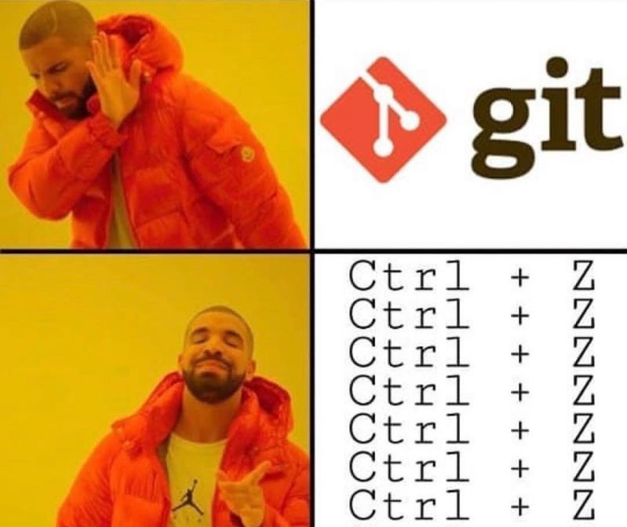

# Общая информация про GIT

Git — это **набор** консольных **утилит**, которые **отслеживают** и **фиксируют изменения** в файлах. 

Изначально Git был создан Линусом Торвальдсом при разработке ядра Linux. Однако инструмент так понравился разработчикам, что в последствии, он получил широкое распространение и его стали использовать в других проектах. 

С его помощью вы можете сравнивать, анализировать, редактировать, сливать изменения и возвращаться назад к последнему сохранению. Этот процесс называется *контролем версий*.

---

## Для начала работы с GIT необходимо

1. Установить

    *[В Windows](https://git-scm.com/book/ru/v2/%D0%92%D0%B2%D0%B5%D0%B4%D0%B5%D0%BD%D0%B8%D0%B5-%D0%A3%D1%81%D1%82%D0%B0%D0%BD%D0%BE%D0%B2%D0%BA%D0%B0-Git)

    *[В Linux](https://git-scm.com/book/ru/v2/%D0%92%D0%B2%D0%B5%D0%B4%D0%B5%D0%BD%D0%B8%D0%B5-%D0%A3%D1%81%D1%82%D0%B0%D0%BD%D0%BE%D0%B2%D0%BA%D0%B0-Git)

2. [Настроить](https://git-scm.com/book/ru/v2/%D0%92%D0%B2%D0%B5%D0%B4%D0%B5%D0%BD%D0%B8%D0%B5-%D0%9F%D0%B5%D1%80%D0%B2%D0%BE%D0%BD%D0%B0%D1%87%D0%B0%D0%BB%D1%8C%D0%BD%D0%B0%D1%8F-%D0%BD%D0%B0%D1%81%D1%82%D1%80%D0%BE%D0%B9%D0%BA%D0%B0-Git)
---

